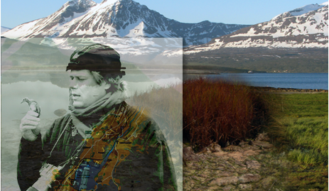

*

**Your personal birdwatching guide** Do you need a birdwatching guide on your visit to Norway? No one knows the country's sites and birds better than Bjørn Olav Tveit, the author of A Birdwatcher's Guide to Norway. Contact him at: [bjorn[@]ornforlag.no](mailto:bjorn@ornforlag.no) for suggestions and offers. Tveit is also a guide for [Birding Norway](http://www.birdingnorway.no/), a company offering local guides all across Norway.  

**Din personlige veiviser** Trenger du en guide for å få maksimalt utbytte av fugleturen din? Ingen kjenner landets fuglelokaliteter så godt som Bjørn Olav Tveit, forfatteren av Guide til Norges fugleliv. Ta kontakt på [bjorn[@]ornforlag.no](mailto:bjorn@ornforlag.no) for turforslag, priser og nærmere avtale. Tveit er også guide for [Birding Norway](http://www.birdingnorway.no/) som tilbyr lokale guider i hele landet.