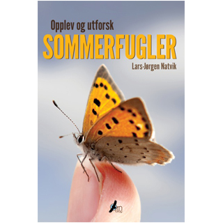

**Vi omgir oss med sommerfugler fra tidlig vår til senhøst, både på solrike sommerenger og ved utelampen om natta. Bare i Norge finnes det 2200 arter som til sammen utgjør et fantastisk mangfold i mønster, fargeprakt og levevis.**

Denne boka gir deg alle de praktiske tipsene til hvordan du selv kan få utbytte av å utforske denne fascinerende dyregruppen, enten du bare vil berike søndagsturen eller du har tenkt å bygge opp din egen sommerfuglsamling.Her beskrives de mest effektive metodene, fra å fange dem med sommerfuglhåv til hvordan du lokker dem til deg med lys og luktstoffer.

Visste du forresten at mange sommerfugler ikke kan motstå duften av vin? Du får også en mengde råd om fotografering, artsbestemmelse, preparering, oppbevaring og systematisering. Du får svar på hvordan du gjør hagen din attraktiv for sommerfugler, hvordan du klekker frem sommerfugllarver og hvordan du deler dine opplevelser og observasjoner med andre sommerfuglentusiaster. _Opplev og utforsk sommerfugler_ er den første boka i sitt slag skrevet for norske forhold. Den er ført i pennen av Lars-Jørgen Natvik, en av Norges fremste sommerfugleksperter.

Forord av Leif Aarvik, samlingsansvarlig for sommerfugler ved Naturhistorisk museum i Oslo.

<form action="https://www.paypal.com/cgi-bin/webscr" method="post" target="_top"><input name="cmd" type="hidden" value="_s-xclick"> <input name="hosted_button_id" type="hidden" value="8YTSHUEX885FA"> <input alt="PayPal – den trygge og enkle metoden for å betale på nettet." border="0" name="submit" src="https://www.paypalobjects.com/no_NO/NO/i/btn/btn_buynowCC_LG.gif" type="image"> </form>

**Trykk på Kjøp nå-knappen over** for å kjøpe boka med betalingskort eller PayPal-konto.

Du får boka i posten i løpet av få dager.  
Alternativt kan du ringe eller sende sms til tlf. 911 89 016, eller send en epost til [bestilling@ornforlag.no](mailto:bestilling@ornforlag.no?subject=Bestilling av Opplev og utforsk sommerfugler).Da kan du få faktura med boka i posten.

**[Bla i deler av boka ved å klikke her!](http://issuu.com/naturogfritid/docs/opplev_og_utforsk_sommerfugler_ekse?mode=window&embedId=1618717/2246059)**  
[**Se forfatterens egen sommerfuglside ved å klikke her!**](http://www.opplevsommerfugler.no/)

_**Hva mener anmelderne?  
"Inspirerende bok om sommerfugler […] Den instruktive teksten er hele tiden godt illustrert med gode tegninger og bilder." **_John-Arvid Grytnes, professor ved Institutt for biologi, Universitetet i Bergen (anmeldelse i [_Naturen_ nr. 2 2015](http://www.idunn.no/natur))

[_**"En grundig, god og vakker bok."**_   Les hele anmeldelsen av boka i Insekt-Nytt ved å klikke her! ](./Sommerfuglbokanmeldelse_Natvik_IN_38-4_RB2013.pdf)

[_**"Jag rekommenderar boken varmt."  **_Les hele anmeldelsen av boka i Entomologisk Tidskrift ved å klikke her!](./Elmqvist_recension_av_Natvik.pdf)

**Lærere anbefales å lese [”Opplev vår fantastiske sommerfuglfauna – et naturfagsprosjekt”](http://www.idunn.no/ts/natur/2014/05/opplev_vaar_fantastiske_sommerfuglfauna_et_naturfagsprosje) i Naturen nr. 5 2014  
_(Et sammendrag finnes [her](http://www.opplevsommerfugler.no/skoler/)_**_)_

**Tittel:** Opplev og utforsk sommerfugler  
**Forfatter:** Lars-Jørgen Natvik  
**Pris:** 398,-  
**Format:** 160x240 mm  
**Sider:** 208 s.  
**Innbinding:** Innbundet  
**ISBN:** 978-82-93314-00-4  
**Utgitt:** mai 2013